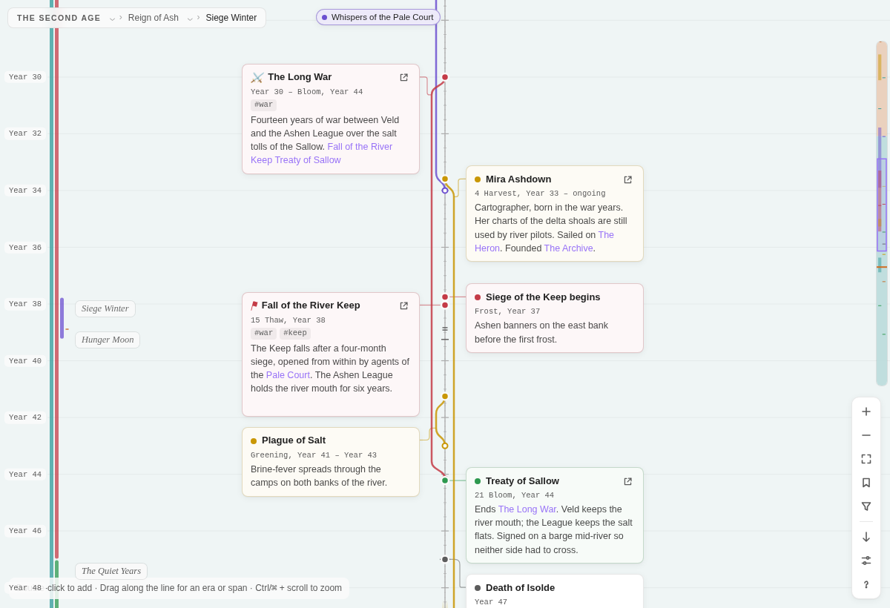
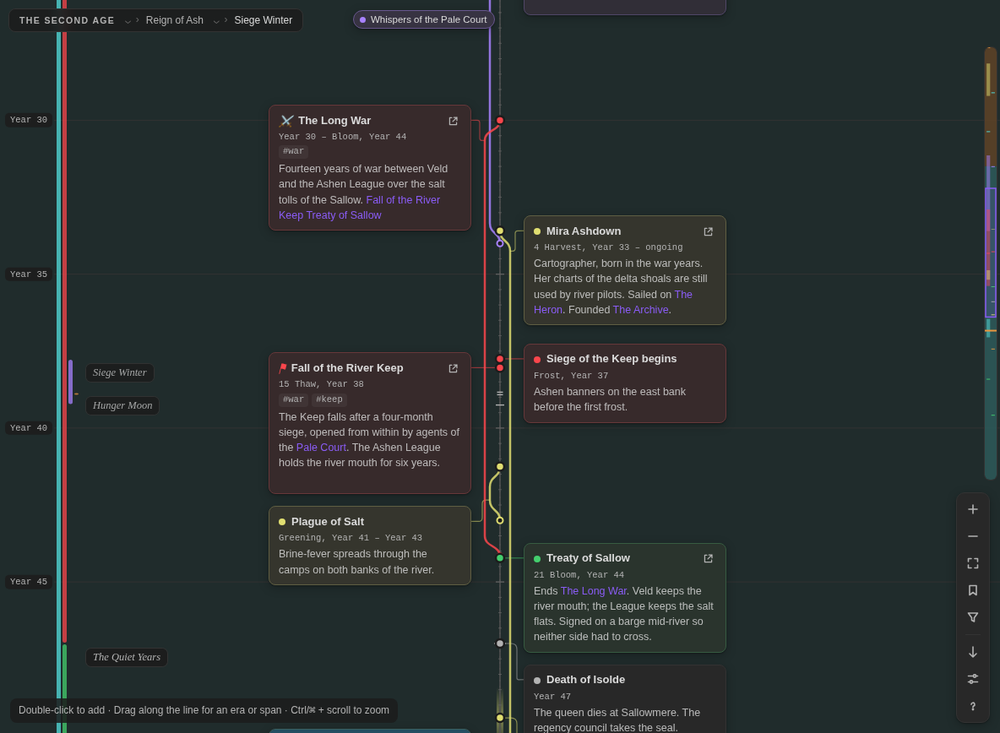

# Evra

Evra is a timeline plugin for Obsidian, built for worldbuilding. You can build a history on your own calendar, divide it into nested eras, and follow long stories as threads beside the line. Cards can link to your notes.

## What it does

- **One line of time, cards on either side.**
  - A card sits exactly on its date.
  - Cards that are close together stack neatly instead of shrinking.
  - When there are too many cards to fit across, the timeline scrolls sideways.
- **Your own calendar.**
  - Set up months of any length, festival days between months, and leap-year rules.
  - Name your weekdays and your units ("cycle" instead of "year").
  - Count years within each era ("12 SA").
  - Show a second calendar alongside the first.
  - Import a calendar from Calendarium or Fantasy-Calendar.
- **Nested eras.** You can nest eras as deep as you like: ages, reigns, wars, seasons. Eras appear as:
  - shaded bands behind the timeline,
  - bars beside the year ruler,
  - labels at every level,
  - a breadcrumb at the top of the view.

  Drag an era's edge to resize it. Right-click an era to fit it to the screen.
- **Spans as threads.** A span, such as a war, a voyage or a life, leaves the line at its start, runs beside it and rejoins it at its end. Its name stays pinned to the edge of the view while you scroll through it. If you prefer, spans can be drawn as shaded blocks instead.
- **Linked notes.**
  - A card linked to a note shows the start of that note, and its cover image if it has one.
  - Drag notes from the file explorer onto the timeline to make cards.
  - You can turn on note sync (it's off by default). It writes each card's date and era into its note's properties. Editing the year in the note then moves the card.
- **Everything else you need to write a history:**
  - Search, and "go to date" (type `14 Frost 412` to jump there).
  - Selecting several cards at once, copy and paste.
  - Filters, tags and icons.
  - Approximate dates, and cards pinned relative to another card ("3 years after the comet").
  - Lifespans that show each person's age on other cards.
  - A "now" marker, a minimap, and saved views.
  - Four directions: top to bottom, bottom to top, left to right and right to left.
  - Export as Markdown, and timelines embedded in notes.

## Getting started

1. Install Evra from **Settings → Community plugins → Browse**, then turn it on.
2. To make a timeline, use the **New timeline** command or the ribbon button. You can also right-click a folder and choose **New timeline**.
3. To look around first, run **Open the sample timeline**. It opens a small world with eras, spans and linked notes.

To add to a timeline:

- **Add an event:** double-click beside the line.
- **Edit a card:** double-click it.
- **Make an era or a span:** drag along the line.
- **See every action:** press <kbd>?</kbd> for the shortcuts, or right-click anywhere.

## Documentation

- [User guide](docs/user-guide.md): cards, spans, eras, selecting, searching and exporting.
- [Calendars](docs/calendars.md): months, leap years, festival days, weekdays, era years, second calendars and importing.
- [Date formats](docs/formats.md): every label template and its tokens.
- [Keyboard and mouse](docs/shortcuts.md)
- [Linked notes and note sync](docs/notes.md)
- [Timelines in notes](docs/embeds.md): the `evra` code block.
- [File format](docs/file-format.md): what's inside a `.evra` file.
- [Development](docs/development.md): building, testing and releasing.

## Privacy and your files

Evra works entirely offline. It makes no network requests and collects nothing.

Evra stores each timeline as its own `.evra` file. The file is readable JSON. Evra changes it when you edit that timeline, and when a note it links to is renamed, so the link keeps working. Evra changes your notes in two cases only:

- when you turn on note sync for a timeline, and then only the notes that timeline links to;
- when you ask it to create a note.

## License

[MIT](LICENSE) © Caleb Smith
